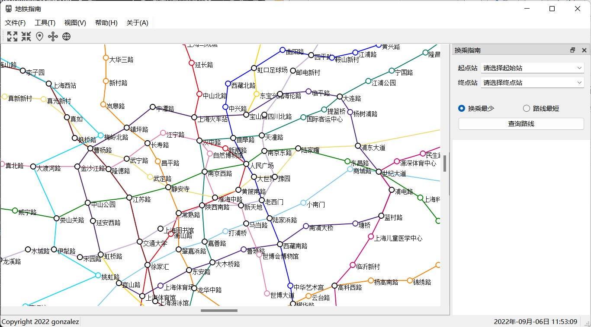
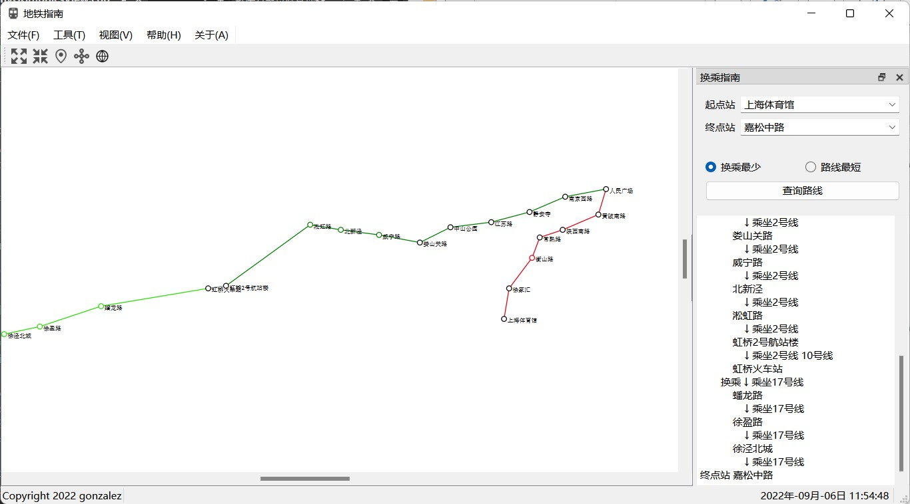
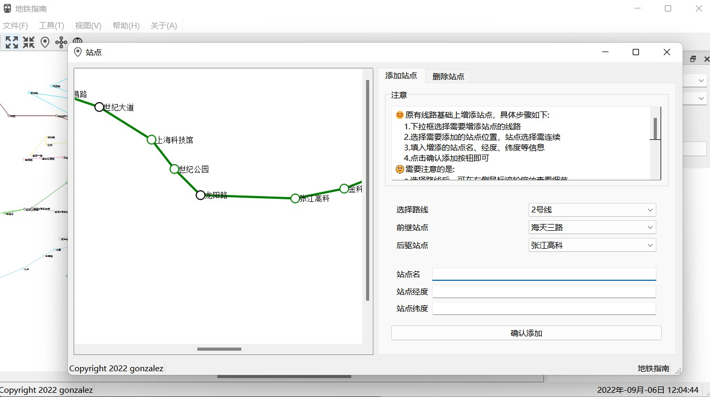
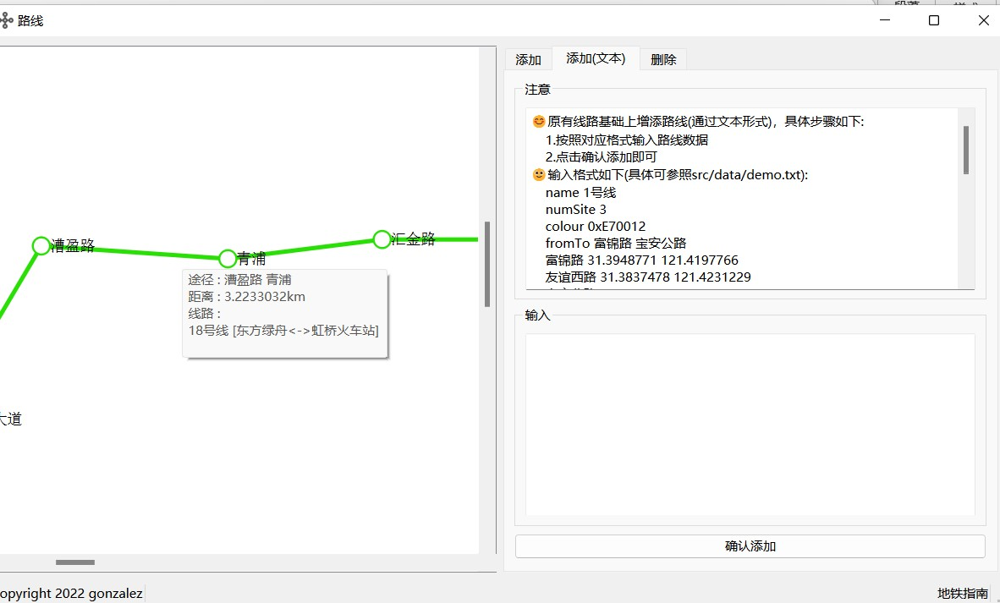
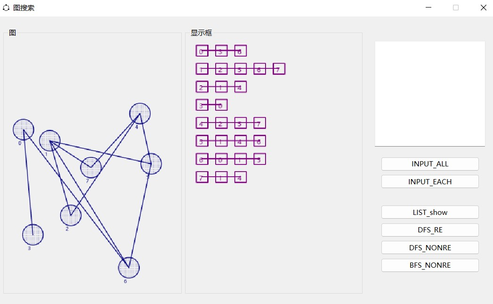
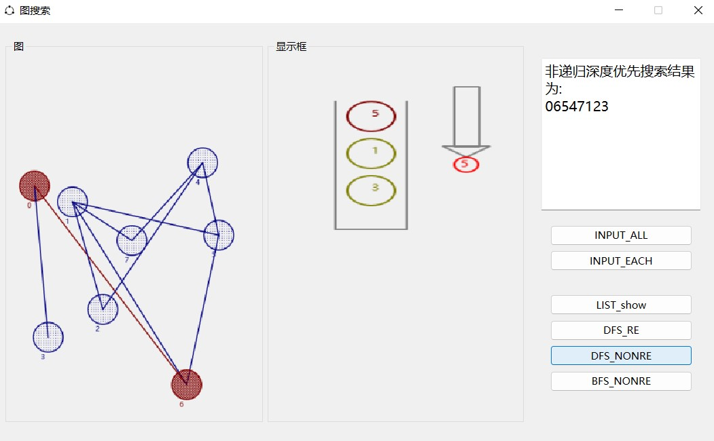
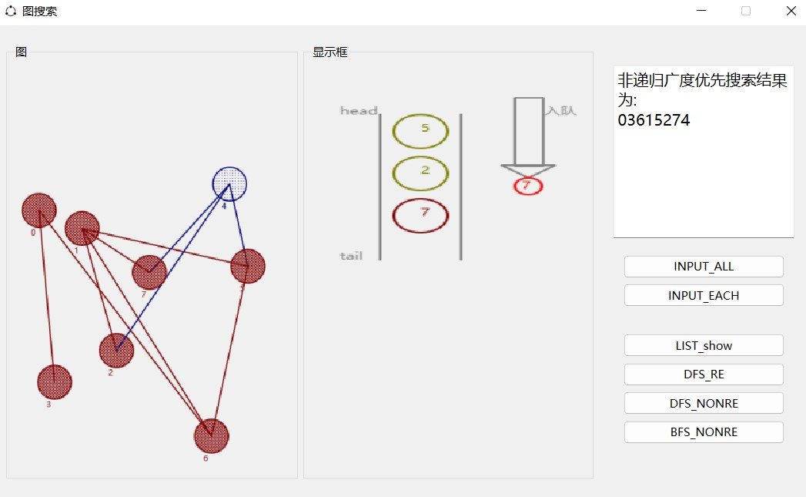

# Metro-Guide🚈
---
### DESCRIPTION
The project is aimed to **guide the routes** of the subways of ShangHai for users.
And you're able to **search the route** from A to B with inputting some information.
**Updating** and **deleting** the info of ShangHai metro will be easy to finish.

BTW, I have completed a small program about `graph search`, before the project.

Here's some info.

### OVERVIEW
#### 1. Metro SH

#### 2. graph search

### REFERENCE
> 100165 数据结构课程设计 暑期大作业
